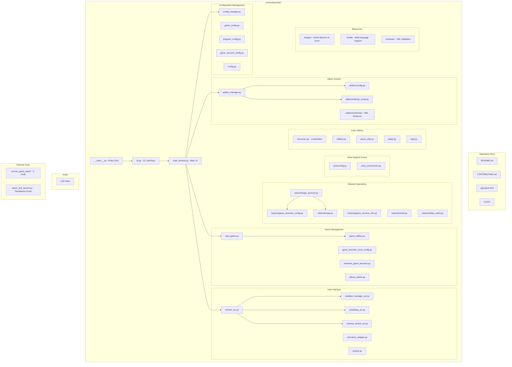
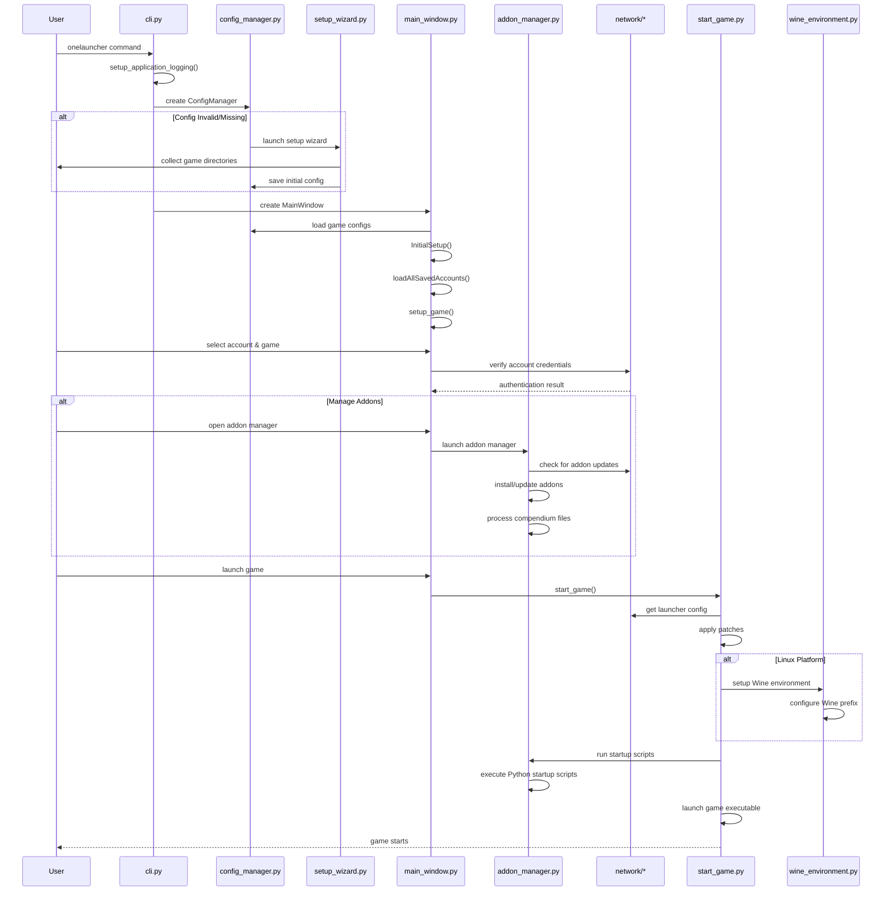

# OneLauncher Architecture

This document provides architectural diagrams and documentation for the OneLauncher codebase.

## Repository Structure

The following diagram shows the organization of the codebase and where each functionality lives:

## Code Flow Sequence Diagram

The following sequence diagram shows the main execution flow of OneLauncher:

## Key Architecture Components

### Entry Points
- **`__main__.py`**: Simple entry point that imports and runs the CLI app
- **`cli.py`**: Main CLI interface using Typer, handles command-line arguments and launches UI

### Configuration System
- **`config_manager.py`**: Central configuration management with TOML files
- **`game_config.py`**: Game-specific configuration (LOTRO/DDO, client types, directories)  
- **`program_config.py`**: Application-wide settings
- **`game_account_config.py`**: User account management with keyring integration

### Addon Management
- **`addon_manager.py`**: Core addon functionality - install, update, manage plugins/skins/music
- **`addons/config.py`**: Addon configuration structures
- **`addons/startup_script.py`**: Python script execution at game launch
- **`addons/schemas/`**: XML schema validation for compendium files

### Game Launching
- **`start_game.py`**: Main game launching logic with patching and Wine support
- **`game_utilities.py`**: Utilities for finding and validating game installations
- **`official_clients.py`**: Definitions for official LOTRO/DDO clients

### Network Layer
- **`network/login_account.py`**: User authentication with game services
- **`network/game_launcher_config.py`**: Download launcher configuration from servers
- **`network/world.py`**: Game world/server management
- **`network/soap.py`**: SOAP service communication

### User Interface
- **`main_window.py`**: Primary application window with account selection and game launching
- **`ui/`**: Qt-based UI components compiled from .ui files
- **`setup_wizard.py`**: First-time setup for new users

### Cross-Platform Support
- **`wine/`**: Wine configuration and environment setup for Linux gaming
- **`resources.py`**: Localization and resource management

### Utilities
- **`async_utils.py`**: Trio-based async helpers for Qt integration
- **`qtapp.py`**: Qt application setup and styling
- **`utilities.py`**: Common utility functions and classes

## Data Flow

1. **Configuration**: TOML files store all settings, managed by ConfigManager
2. **Authentication**: Credentials stored in system keyring, validated via network layer
3. **Addons**: XML compendium files describe addon metadata, installed to game directories
4. **Game Launching**: Patches applied, Wine configured (Linux), startup scripts executed
5. **Network**: HTTPS/SOAP communication with official game services

## Key Design Patterns

- **Configuration as Code**: Strongly-typed configuration with attrs/cattrs
- **Async/Await**: Trio for concurrent operations within Qt event loop
- **Plugin Architecture**: Extensible addon system with startup scripts
- **Cross-Platform**: Abstracted Wine integration for Linux support
- **Type Safety**: Heavy use of mypy and type annotations throughout