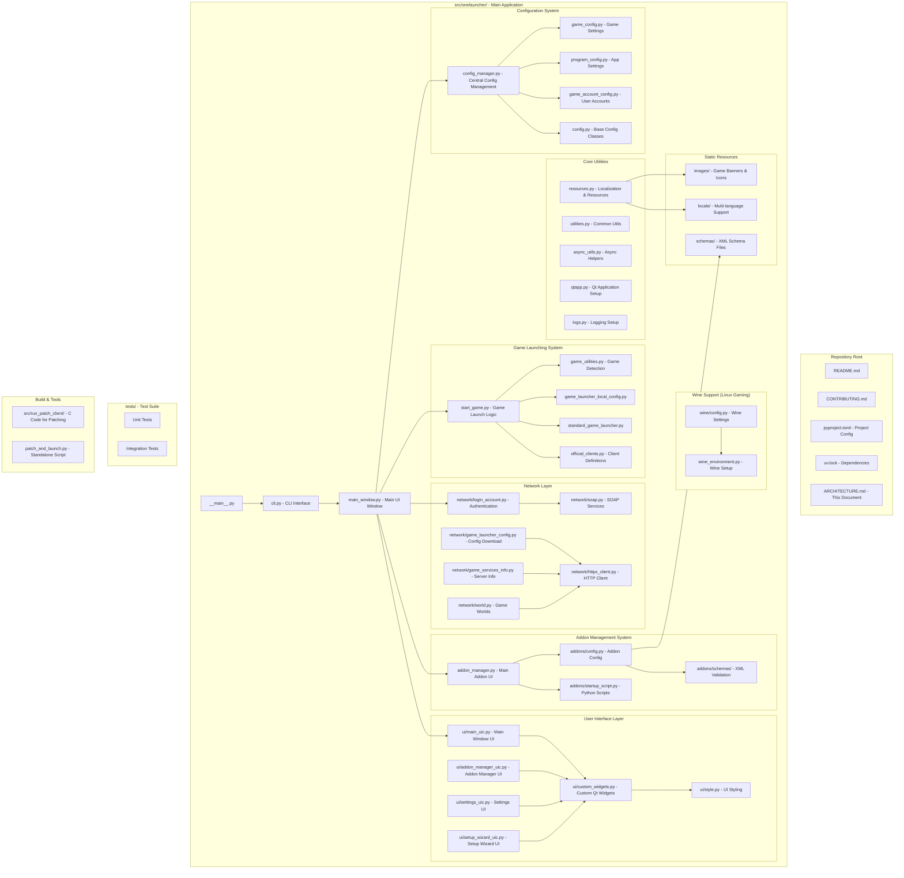
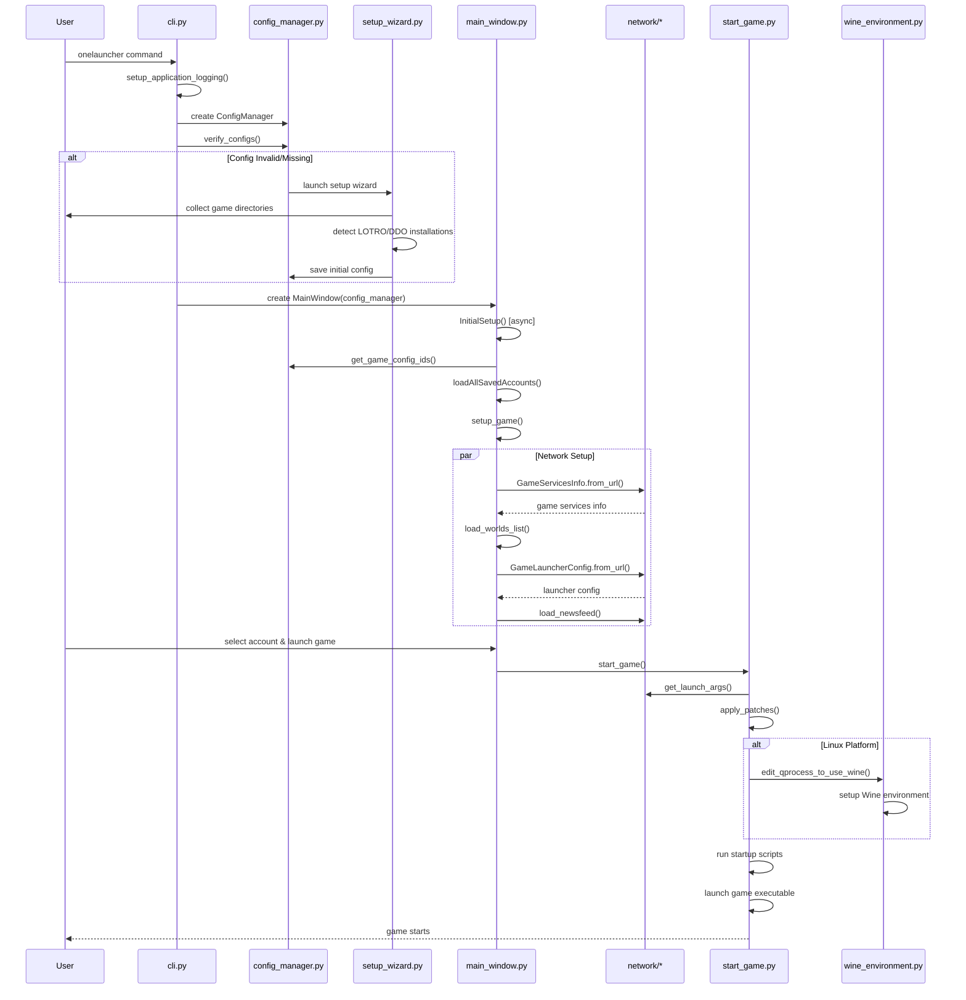
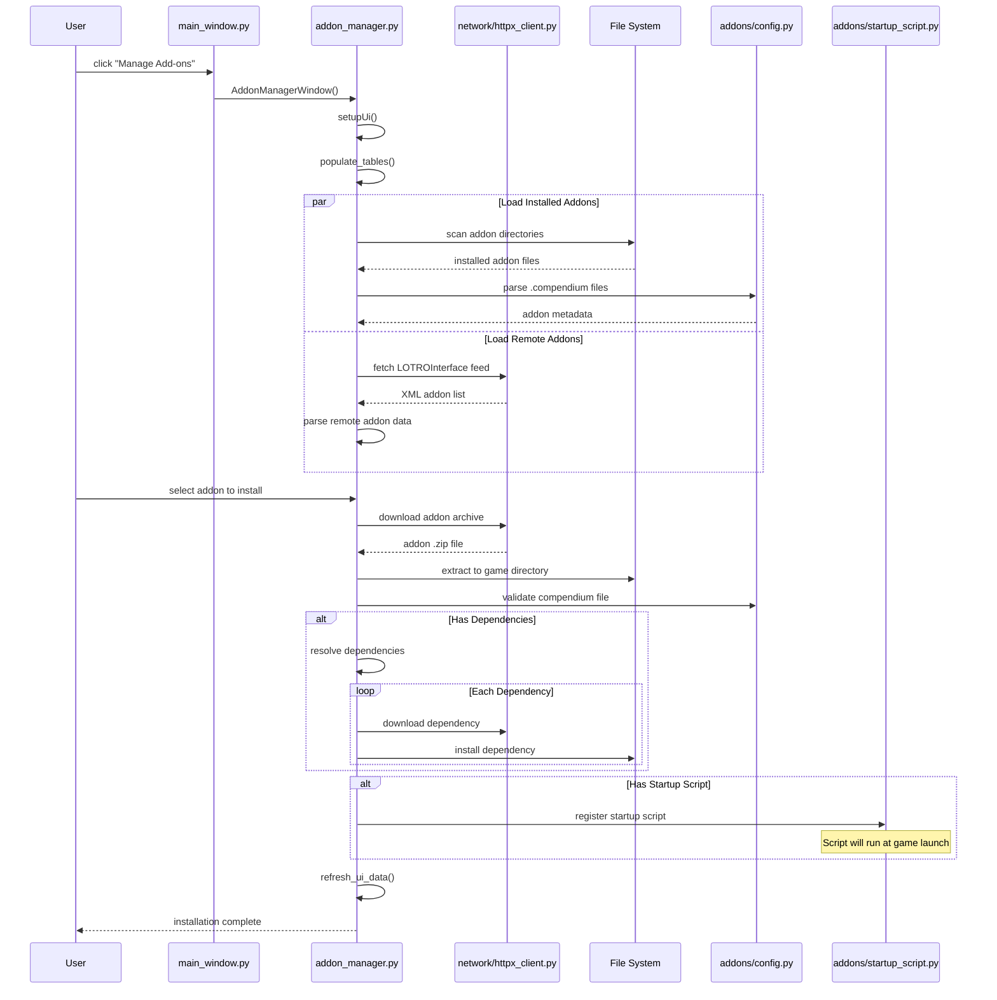
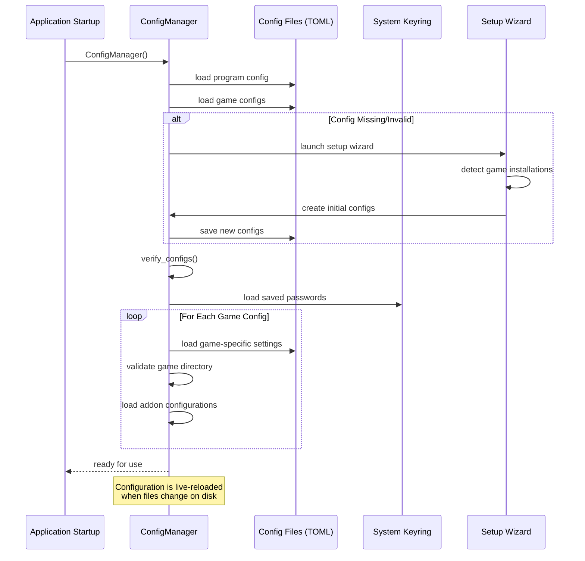
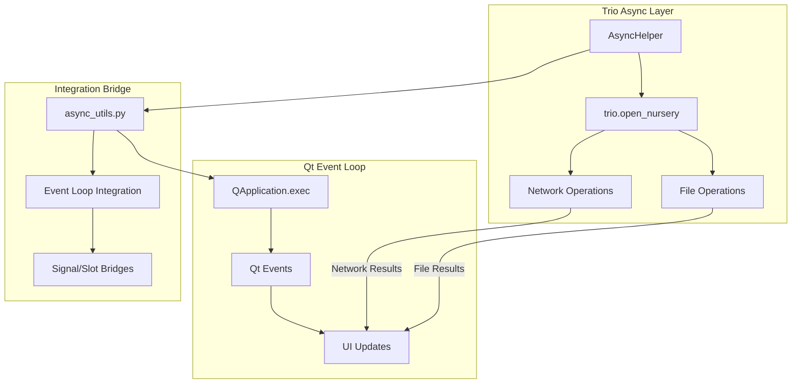

# OneLauncher Architecture

This document provides architectural diagrams and documentation for the OneLauncher codebase.

## Repository Structure

The following diagram shows the organization of the codebase and where each functionality lives:



## Code Flow Sequence Diagrams

### Main Application Flow

The following sequence diagram shows the main execution flow of OneLauncher:



### Addon Management Flow

The following diagram shows the detailed addon management workflow:



### Configuration Management Flow

The following diagram shows how configuration is managed throughout the application:



## Async Architecture

OneLauncher uses a sophisticated async architecture combining Qt's event loop with Trio for structured concurrency:



## Key Architecture Components

### Entry Points
- **`__main__.py`**: Simple entry point that imports and runs the CLI app
- **`cli.py`**: Main CLI interface using Typer, handles command-line arguments and launches UI

### Configuration System
- **`config_manager.py`**: Central configuration management with TOML files and live reloading
- **`game_config.py`**: Game-specific configuration (LOTRO/DDO, client types, directories)  
- **`program_config.py`**: Application-wide settings and preferences
- **`game_account_config.py`**: User account management with secure keyring integration

### Addon Management
- **`addon_manager.py`**: Core addon functionality - install, update, manage plugins/skins/music
- **`addons/config.py`**: Addon configuration structures and compendium parsing
- **`addons/startup_script.py`**: Python script execution at game launch with sandboxed globals
- **`addons/schemas/`**: XML schema validation for compendium files and addon metadata

### Game Launching
- **`start_game.py`**: Main game launching logic with patching and Wine support
- **`game_utilities.py`**: Utilities for finding and validating game installations
- **`official_clients.py`**: Definitions for official LOTRO/DDO clients and their capabilities

### Network Layer  
- **`network/login_account.py`**: User authentication with game services via SOAP
- **`network/game_launcher_config.py`**: Download launcher configuration from official servers
- **`network/world.py`**: Game world/server management and selection
- **`network/soap.py`**: SOAP service communication with authentication servers

### User Interface
- **`main_window.py`**: Primary application window with account selection and game launching
- **`ui/`**: Qt-based UI components compiled from .ui files using pyside6-uic
- **`setup_wizard.py`**: First-time setup wizard for new users

### Cross-Platform Support
- **`wine/`**: Wine configuration and environment setup for Linux gaming
- **`resources.py`**: Localization and resource management with multi-language support

### Utilities
- **`async_utils.py`**: Trio-based async helpers for Qt integration using structured concurrency
- **`qtapp.py`**: Qt application setup, styling, and theme management
- **`utilities.py`**: Common utility functions and classes including path helpers

## File Organization Patterns

The codebase follows clear organizational patterns:

### Configuration Files
```
~/.config/onelauncher.toml          # Main program configuration
~/.local/share/OneLauncher/games/   # Game-specific configurations
```

### Addon Structure
```
Documents/The Lord of the Rings Online/
├── Plugins/
│   ├── PluginName/
│   │   ├── PluginName.plugin
│   │   └── PluginName.plugincompendium
│   └── ...
├── Skins/
└── Music/
```

### UI Component Organization
```
ui/
├── *.ui                 # Qt Designer files
├── *_uic.py            # Compiled UI files (auto-generated)
├── custom_widgets.py   # Custom Qt components
└── style.py           # Theming and styling
```

## Data Flow

1. **Configuration**: TOML files store all settings, managed centrally by ConfigManager
2. **Authentication**: Credentials stored securely in system keyring, validated via SOAP services
3. **Addons**: XML compendium files describe addon metadata, installed to game directories
4. **Game Launching**: Patches applied, Wine configured (Linux), startup scripts executed
5. **Network**: HTTPS/SOAP communication with official game services for auth and updates

## Key Design Patterns

- **Configuration as Code**: Strongly-typed configuration with attrs/cattrs for serialization
- **Async/Await**: Trio for concurrent operations within Qt event loop using structured concurrency
- **Plugin Architecture**: Extensible addon system with startup scripts and dependency resolution
- **Cross-Platform**: Abstracted Wine integration for seamless Linux gaming support
- **Type Safety**: Heavy use of mypy and type annotations throughout for reliability
- **Separation of Concerns**: Clear module boundaries between UI, business logic, and data access