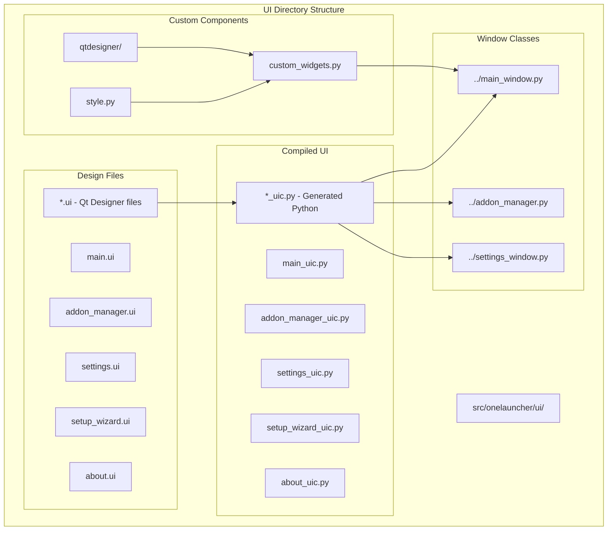
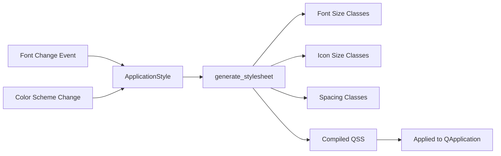
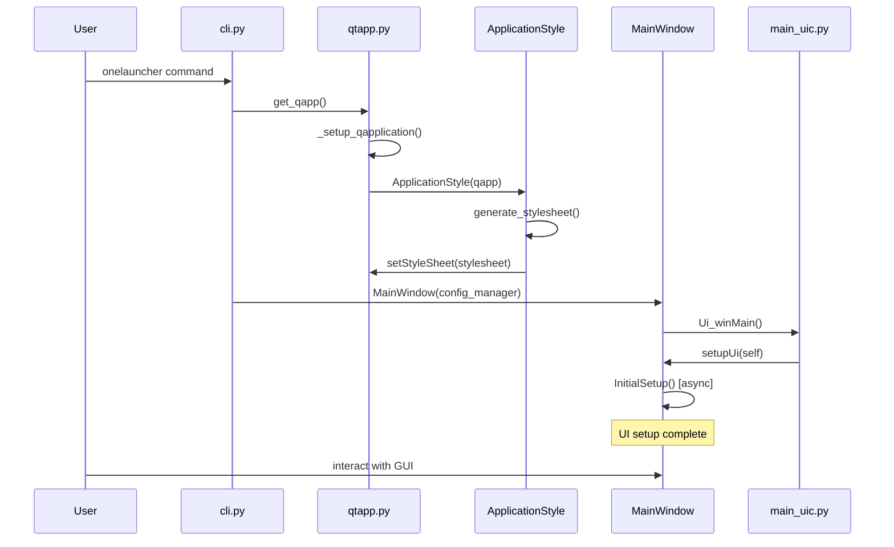
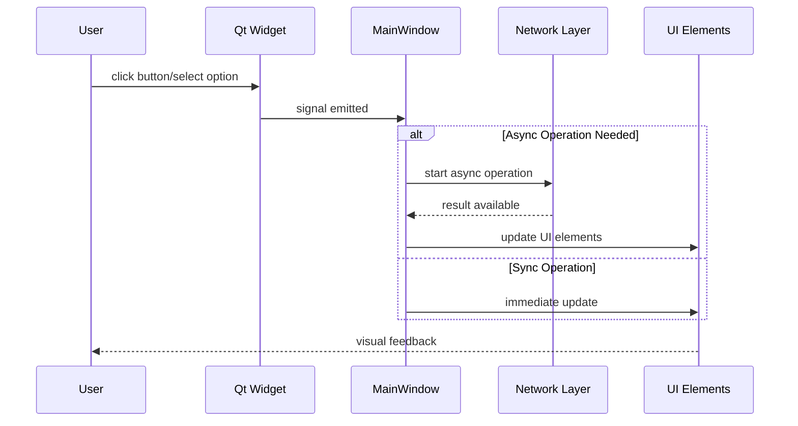
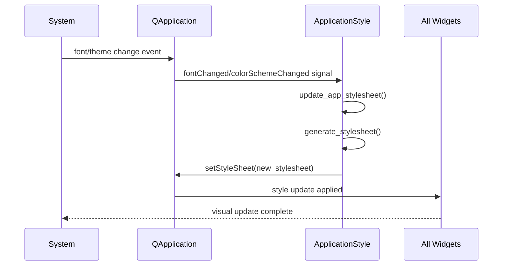
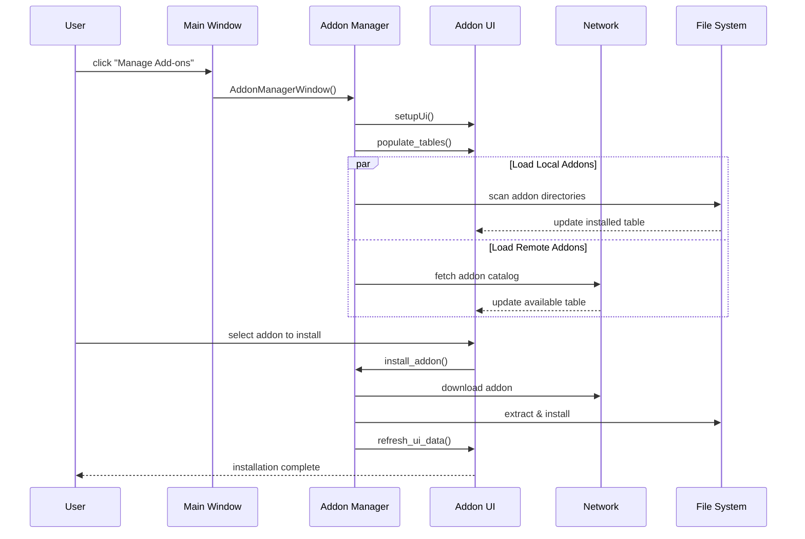
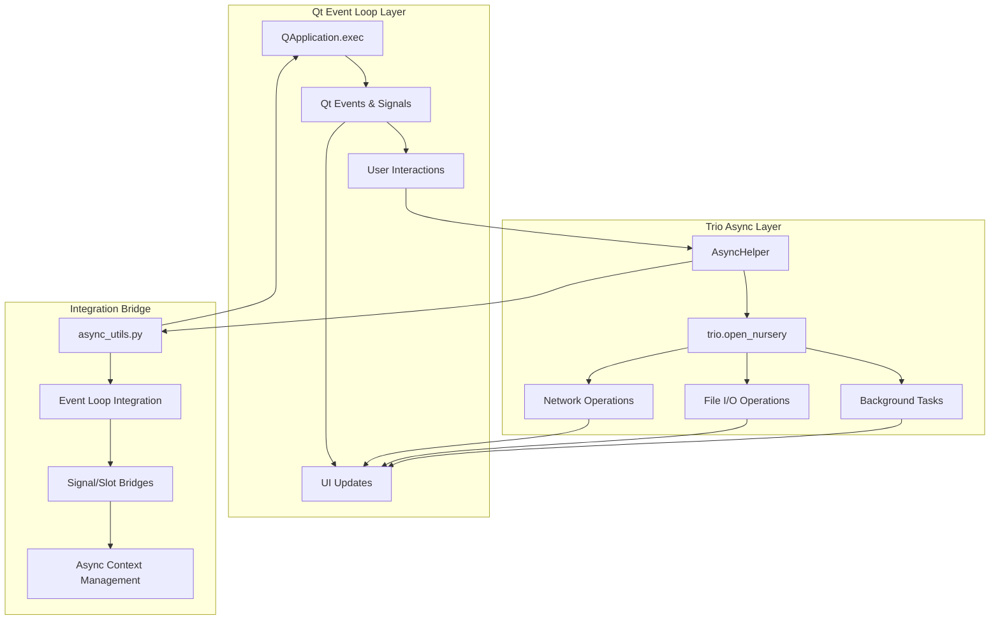

# OneLauncher GUI Architecture Documentation

This document provides comprehensive documentation about OneLauncher's Graphical User Interface (GUI) architecture, implementation, and styling system.

## Table of Contents

1. [Overview](#overview)
2. [GUI Libraries and Dependencies](#gui-libraries-and-dependencies)
3. [UI Component Structure](#ui-component-structure)
4. [Styling System](#styling-system)
5. [GUI Code Flow](#gui-code-flow)
6. [Custom Widgets](#custom-widgets)
7. [UI Development Workflow](#ui-development-workflow)
8. [Async GUI Architecture](#async-gui-architecture)

## Overview

OneLauncher's GUI is built using **PySide6** (Qt6 for Python) with a sophisticated async architecture that combines Qt's event loop with Trio for structured concurrency. The application features a modern, responsive design with a custom Tailwind-like styling system and frameless window design.

### Key Features

- **Modern Qt6/PySide6 Interface**: Native desktop application with cross-platform support
- **Frameless Window Design**: Custom window decorations for a modern look
- **Responsive Styling**: Tailwind CSS-inspired QSS (Qt Style Sheet) system
- **Async Architecture**: Non-blocking UI with Trio-based concurrency
- **Custom Widgets**: Specialized components for game launcher functionality
- **Live Style Preview**: Real-time styling updates in Qt Designer

## GUI Libraries and Dependencies

### Core GUI Libraries

```toml
# Main GUI framework
"PySide6-Essentials>=6.7.2"          # Qt6 Python bindings

# UI Enhancement libraries  
"qtawesome>=1.3.1"                   # Font Awesome icons for Qt
"pysidesix-frameless-window>=0.3.12"  # Modern frameless window support

# Additional UI-related dependencies
"Babel>=2.16.0"                       # Internationalization support
```

### Library Purposes

| Library | Purpose | Usage in OneLauncher |
|---------|---------|---------------------|
| **PySide6-Essentials** | Core Qt6 framework | Main UI framework, widgets, layouts, events |
| **qtawesome** | Icon management | Provides Font Awesome icons throughout the interface |
| **pysidesix-frameless-window** | Modern window design | Creates frameless windows with custom title bars |
| **Babel** | Internationalization | Multi-language support for UI text |

### Qt Modules Used

```python
from PySide6 import QtCore, QtGui, QtWidgets
from PySide6.QtCore import Qt, QTimer, QEventLoop
from PySide6.QtGui import QIcon, QPixmap, QFont
from PySide6.QtWidgets import QApplication, QMainWindow, QDialog
```

## UI Component Structure

OneLauncher's UI follows a structured organization pattern with clear separation between design files, compiled UI code, and custom logic.

### File Organization



### Main UI Components

#### 1. Main Window (`main.ui` / `main_window.py`)
- **Purpose**: Primary application interface
- **Features**: Game selection, account management, news feed, launch controls
- **Custom Elements**: Game banner, world selection, login controls

#### 2. Addon Manager (`addon_manager.ui` / `addon_manager.py`)
- **Purpose**: Plugin/addon management interface
- **Features**: Install, update, remove addons; browse addon catalog
- **Custom Elements**: Addon tables, dependency resolution UI

#### 3. Settings Window (`settings.ui` / `settings_window.py`)
- **Purpose**: Application configuration interface
- **Features**: Game settings, UI preferences, account management
- **Custom Elements**: Tabbed settings interface

#### 4. Setup Wizard (`setup_wizard.ui`)
- **Purpose**: First-time setup and game detection
- **Features**: Game directory detection, initial configuration
- **Custom Elements**: Multi-step wizard interface

## Styling System

OneLauncher implements a sophisticated styling system inspired by Tailwind CSS, using Qt Style Sheets (QSS) with dynamic properties.

### QSS Class System

#### How It Works

```python
# Dynamic property used for styling, like the class attribute in HTML
CLASS_PROPERTY: str = "qssClass"
```

1. **Dynamic Properties**: Widgets use the `qssClass` dynamic property (StringList type)
2. **Class-Based Styling**: Each string in the list acts as a CSS class
3. **Responsive Sizing**: Classes set sizes relative to system font size
4. **Live Preview**: Changes visible immediately in Qt Designer

#### Supported Style Classes

```python
# Spacing system (rem-based)
SPACING: Final[dict[str, Rem]] = {
    "0": 0.0, "0.5": 0.125, "1": 0.25, "1.5": 0.375,
    "2": 0.5, "2.5": 0.625, "3": 0.75, "3.5": 0.875,
    "4": 1.0, "5": 1.25, "6": 1.5, "7": 1.75,
    "8": 2.0, "9": 2.25, "10": 2.5, "11": 2.75,
    "12": 3.0, "14": 3.5, "16": 4.0, "20": 5.0,
    # ... continues to "72": 18.0
}
```

#### Available Style Types

| Type | Purpose | Example Classes |
|------|---------|----------------|
| **Padding** | Internal spacing | `p-4`, `px-2`, `py-6` |
| **Margin** | External spacing | `m-4`, `mx-2`, `my-6` |
| **Width** | Element width | `w-32`, `w-full` |
| **Height** | Element height | `h-16`, `h-auto` |
| **Font Size** | Text sizing | `text-sm`, `text-lg`, `text-xl` |
| **Icon Size** | Icon dimensions | `icon-sm`, `icon-lg` |

#### Usage Example

```xml
<!-- In .ui file -->
<widget class="QPushButton" name="btnLogin">
    <property name="qssClass" stdset="0">
        <stringlist>
            <string>px-4</string>
            <string>py-2</string>
            <string>text-lg</string>
        </stringlist>
    </property>
</widget>
```

### Style Generation



#### ApplicationStyle Class

```python
class ApplicationStyle(QtCore.QObject):
    """
    Manages app stylesheet.
    There should only ever be one instance of this class for every QApplication
    """
    
    def __init__(self, qapp: QApplication) -> None:
        super().__init__()
        self.qapp = qapp
        self.update_app_stylesheet()
        qapp.fontChanged.connect(self.update_base_font)
        qapp.styleHints().colorSchemeChanged.connect(self.update_app_stylesheet)
    
    def rem_to_px(self, rem: Rem) -> int:
        """Convert rem units to pixels based on base font size"""
        return round(self._base_font_metrics.height() * rem)
```

## GUI Code Flow

### Application Startup Flow



### UI Update Flow



### Style Update Flow



### Addon Manager GUI Flow



## Custom Widgets

OneLauncher implements several custom widgets to enhance the user experience beyond standard Qt widgets.

### FramelessQMainWindowWithStylePreview

```python
class FramelessQMainWindowWithStylePreview(
    FramelessMainWindow, QMainWindowWithStylePreview
): ...
```

**Purpose**: Combines frameless window functionality with style preview capabilities

**Features**:
- Modern frameless window design
- Custom title bar implementation
- Live style preview in Qt Designer
- Cross-platform window management

### GameNewsfeedBrowser

```python
class GameNewsfeedBrowser(QtWidgets.QTextBrowser):
    def __init__(self, parent: QtWidgets.QWidget | None = None) -> None:
        super().__init__(parent)
        self.setOpenExternalLinks(True)
        self.setOpenLinks(True)
        self.html: str | None = None
        get_qapp().styleHints().colorSchemeChanged.connect(self.updateStyling)
```

**Purpose**: Specialized browser for displaying game news feeds

**Features**:
- Automatic external link handling
- Theme-aware CSS styling
- Dynamic style updates on system theme changes
- Custom news feed formatting

### NoOddSizesQToolButton

```python
class NoOddSizesQToolButton(QtWidgets.QToolButton):
    """
    Helps icon only buttons keep their icon better centered.
    """
```

**Purpose**: Improved icon-only button with better centering

**Features**:
- Better icon alignment
- Consistent sizing behavior
- Improved visual appearance

### Qt Designer Plugins

#### StylePreviewPlugin

```python
class CustomStylesheetPlugin(QtDesigner.QDesignerCustomWidgetInterface):
    def initialize(self, form_editor: QtDesigner.QDesignerFormEditorInterface) -> None:
        self._app_stylesheet = ApplicationStyle(qapp).generate_stylesheet(
            qtdesigner_version=True
        )
```

**Purpose**: Enables live style preview in Qt Designer

**Features**:
- Real-time style updates in designer
- Custom widget support
- QSS class preview functionality

## UI Development Workflow

### Creating New UI Components

1. **Design in Qt Designer**
   ```bash
   onelauncher designer  # Launch Qt Designer with OneLauncher plugins
   ```

2. **Compile UI to Python**
   ```bash
   pyside6-uic src/onelauncher/ui/example_window.ui -o src/onelauncher/ui/example_window_uic.py
   ```

3. **Create Window Class**
   ```python
   from .ui.example_window_uic import Ui_exampleWindow
   
   class ExampleWindow(FramelessQDialogWithStylePreview):
       def __init__(self):
           super().__init__()
           self.ui = Ui_exampleWindow()
           self.ui.setupUi(self)
   ```

### Styling Workflow

1. **Add QSS Classes in Designer**
   - Select widget in Qt Designer
   - Add dynamic property `qssClass` (StringList type)
   - Add class names like `px-4`, `py-2`, `text-lg`

2. **Preview Styles**
   - Styles update live in Qt Designer
   - Test different responsive breakpoints
   - Verify cross-platform appearance

3. **Custom Styles**
   ```python
   # Add custom styles to ApplicationStyle.generate_stylesheet()
   stylesheet += """
   QWidget#myCustomWidget {
       background-color: palette(window);
       border-radius: 4px;
   }
   """
   ```

### Testing UI Changes

```bash
# Run application to test changes
python -m onelauncher

# Test with different system themes
# Test with different font sizes
# Test window resizing behavior
```

## Async GUI Architecture

OneLauncher uses a sophisticated async architecture that combines Qt's event loop with Trio for structured concurrency.

### Architecture Overview



### Key Components

#### AsyncHelper Integration

```python
# In cli.py
async_helper = AsyncHelper(partial(_main, entry=entry))
QtCore.QTimer.singleShot(0, async_helper.launch_guest_run)
# qapp.exec() won't return until trio event loop finishes
sys.exit(qapp.exec())
```

#### Async UI Operations

```python
# In MainWindow
async def InitialSetup(self) -> None:
    # UI state management
    self.ui.cboAccount.setEnabled(False)
    self.ui.txtPassword.setEnabled(False)
    
    # Async network operations
    async with trio.open_nursery() as self.network_setup_nursery:
        self.network_setup_nursery.start_soon(self.game_initial_network_setup)
```

#### Non-blocking UI Updates

```python
async def game_initial_network_setup(self) -> None:
    try:
        # Async network call
        game_services_info = await GameServicesInfo.from_url(...)
        
        # UI updates on main thread
        self.load_worlds_list(game_services_info)
        self.ui.cboWorld.setEnabled(True)
        self.ui.btnLogin.setEnabled(True)
    except httpx.HTTPError:
        logger.exception("Network error...")
```

### Benefits

1. **Responsive UI**: Network operations don't block the interface
2. **Structured Concurrency**: Trio's nursery pattern for safe async operations
3. **Error Handling**: Proper exception handling across async boundaries
4. **Resource Management**: Automatic cleanup of async operations

---

This documentation provides a comprehensive overview of OneLauncher's GUI architecture. For implementation details, refer to the source code in `src/onelauncher/ui/` and related modules.